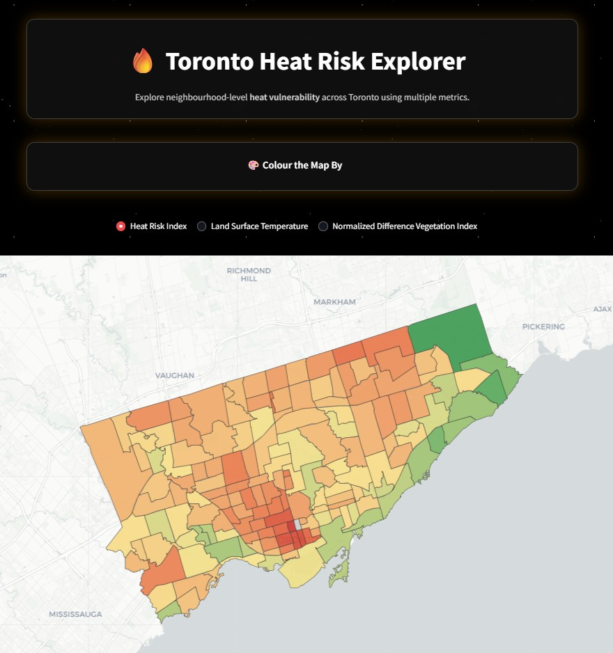

# 🌍 Toronto Heat Risk Dashboard

An interactive web application built with [Streamlit](https://streamlit.io/) to visualize and analyze **urban heat risk across Toronto**.
This tool combines **satellite data** (land surface temperature, vegetation cover) with **demographic and socio-economic indicators** to highlight neighborhoods most vulnerable to extreme heat.

---

## 🚀 Live Demo

👉 Try it here: PLACEHOLDER



---

## ✨ Features

- 🗺️ **Interactive Map Explorer** – Explore Toronto neighborhoods and their relative heat risk.
- 🌡️ **Land Surface Temperature (LST)** – Derived from NASA MODIS satellite data.
- 🌿 **Vegetation Index (NDVI)** – Visualize cooling effects of green cover.
- 🏘️ **Socio-Economic Layers** – Incorporates census data (age, income, living status, etc.) for vulnerability.
- 📊 **Dynamic Filters** – Toggle different indicators and compare across neighborhoods.
- ⚡ **Fast & Responsive** – Optimized with Streamlit caching.

---

## 📊 Data Sources

- **NASA AppEEARS** – MODIS LST & NDVI satellite data
- **City of Toronto Open Data** – Neighborhood boundaries, demographics
- **Statistics Canada Census 2021** – Socio-economic indicators

---

## 🛠️ Tech Stack

- **Frontend / UI:** Streamlit
- **Data Processing:** Pandas, GeoPandas, Rasterio, NumPy
- **Visualization:** Folium / Leafmap, Matplotlib
- **Deployment:** Streamlit Community Cloud
- [PLACEHOLDER: add any other major tools you used (e.g., Shapely, AppEEARS API, PyProj)]

---

## 📂 Project Structure

```plaintext
urban-heat-risk-explorer/
│
├── app.py                  # Main Streamlit app
├── requirements.txt        # Project dependencies
├── data/                   # Input datasets (LST, NDVI, census)
├── utils/                  # Helper scripts (data loading, preprocessing)
└── README.md               # Project documentation
```

---

## 🔧 Installation

If you want to run this app locally instead of using the deployed version:

```bash
git clone https://github.com/[PLACEHOLDER:your-username]/urban-heat-risk-explorer.git
cd urban-heat-risk-explorer
pip install -r requirements.txt
```

Then launch the app with:

```bash
streamlit run app.py
```

---

## 📌 Roadmap / Future Improvements

- 🔒 Add authentication for private/public deployments
- 📱 Improve mobile responsiveness
- 📈 Incorporate additional risk factors (air quality, housing type, building age)
- 🌐 Extend the model to other major world cities for comparative analysis
- [PLACEHOLDER: add your own planned improvements here]

---

## 🤝 Contributing

Contributions, issues, and feature requests are welcome!

1. Fork the repository
2. Create a feature branch (`git checkout -b feature/my-feature`)
3. Commit your changes (`git commit -m 'Add new feature'`)
4. Push to the branch (`git push origin feature/my-feature`)
5. Open a Pull Request

Please ensure your code follows best practices and is well-documented.

---

## 📄 License

This project is licensed under the **MIT License**.
You are free to use, modify, and distribute this software for both personal and commercial purposes, provided that proper credit is given. See the [LICENSE](LICENSE) file for full details.
